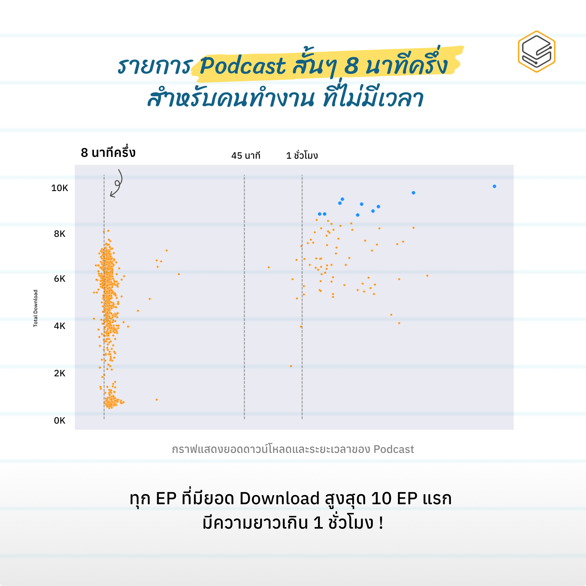

# Web Scraping by BeautifulSoup, Selenium-wire and Data Analysis
*Contributed to Skooldio*
##### <u>**Objective** : Web scrape Podbean and data analysis for creating marketing content.</u> 

*by Patcharanat P.* 

**Data: [Website Podbean](https://eighthalf.podbean.com/)** 

### Table of contents
* Import Library
* Data Understanding
* Web Scraping
* Data Cleaning and Transformation
* Exploratory Data Analysis

# Final Result

